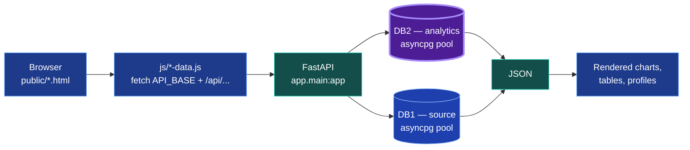
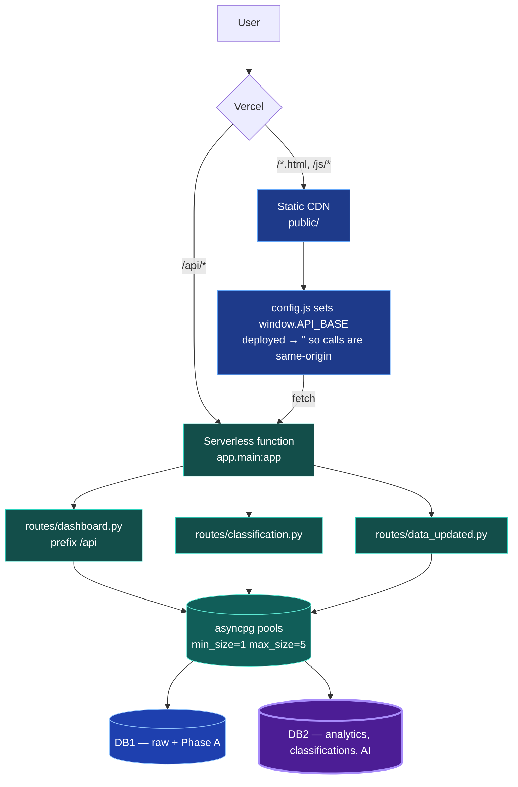
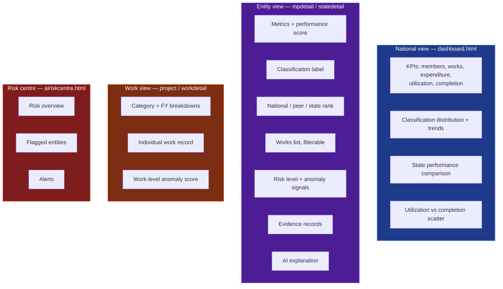
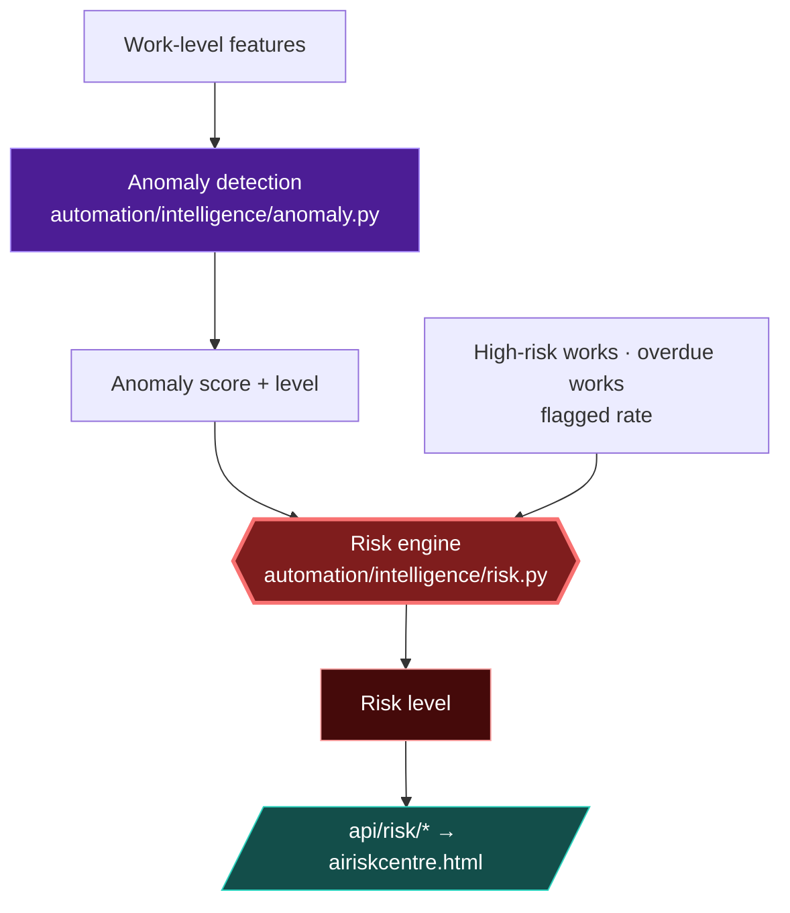
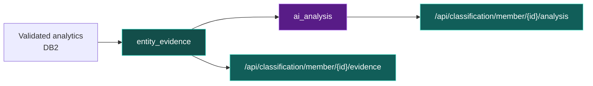
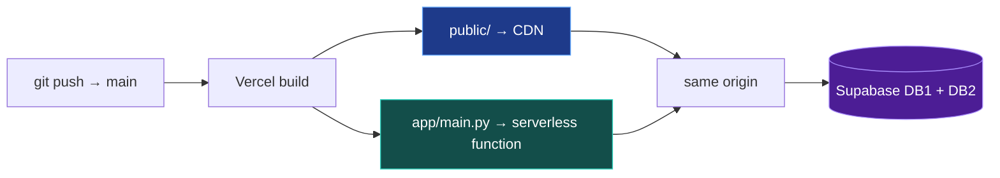

<div align="center">


# GovSense AI

### AI-Powered Civic Intelligence for MPLADS Data

Interactive dashboards and analytics over the **MPLADS** (Members of Parliament Local Area Development Scheme) dataset — national overview, MP/MLA and state profiles, project analytics, and an AI-assisted risk centre.

[**Live →** smart-india-hackathon-26.vercel.app](https://smart-india-hackathon-26.vercel.app)


**Built by Team Spark · Smart India Hackathon 2026**

</div>

---

GovSense AI is a **static frontend** (HTML + Tailwind CDN + vanilla JS) backed by a **FastAPI** service that reads from **two Supabase Postgres databases**. The frontend renders precomputed analytics; the API is read-only; the heavy analysis happens offline and lands in the database before anyone opens a page.

> **GovSense AI is not an official government service.** It is an independent analytical tool built to promote transparency and data-driven civic awareness, over publicly available data from the MoSPI / NIC MPLADS Portal.



---

## Contents

[Architecture](#architecture) · [Repository layout](#repository-layout) · [Frontend](#frontend) · [Backend](#backend) · [API reference](#api-reference) · [Database access](#database-access) · [Caching](#caching) · [What the analytics show](#what-the-analytics-show) · [Performance scoring](#performance-scoring) · [Risk & anomaly signals](#risk--anomaly-signals) · [Evidence & AI explanations](#evidence--ai-explanations) · [Where the data comes from](#where-the-data-comes-from) · [Tech stack](#tech-stack) · [Local development](#local-development) · [Environment variables](#environment-variables) · [Deployment](#deployment) · [Responsible use](#responsible-use) · [Limitations](#limitations) · [Team](#team)

---

## Architecture

One Vercel project serves both halves. Vercel auto-detects the FastAPI app at `app/main.py` and turns it into a single serverless function; the static pages in `public/` are served from the CDN at their root paths. Because frontend and API share an origin in production, **no CORS configuration is needed there**.



### How the API base resolves

`public/js/config.js` sets `window.API_BASE` before any data script runs:

| Host | `API_BASE` | Effect |
|---|---|---|
| `localhost` · `127.0.0.1` · `file:` | `http://127.0.0.1:8000` | Calls the local uvicorn server |
| Any deployed host | `''` (empty) | Calls are relative — `/api/...` on the same origin |

It also sets `window.APP_VERSION` as a build marker, bumped when frontend JS changes so a cached old frontend can be told apart from a new deployment. Consumers use it for a one-time, app-scoped cache reset — never a page reload, so there is no reload loop.

---

## Repository layout

```text
.
├── app/                    # FastAPI application
│   ├── main.py             # ASGI entrypoint (exposes `app`) — Vercel entrypoint
│   ├── config.py           # pydantic-settings; reads environment / .env
│   ├── database.py         # asyncpg connection pools (DB1 + DB2)
│   ├── classification.py   # deterministic performance classification
│   └── routes/
│       ├── dashboard.py       # the bulk of the API (prefix /api)
│       ├── classification.py  # classification, evidence, AI analysis
│       └── data_updated.py    # data freshness endpoint
├── public/                 # Static frontend, served from the CDN at the root URL
│   ├── index.html          # splash → dashboard.html
│   ├── dashboard.html · mps.html · mpdetail.html
│   ├── state.html · statedetail.html
│   ├── project.html · workdetail.html · airiskcentre.html
│   ├── about.html · methodology.html · api-docs.html · privacy.html
│   ├── js/                 # frontend logic (one *-data.js per page)
│   └── favicon/ · logo.png
├── automation/             # offline pipeline + intelligence layer
│   └── intelligence/       # performance, clustering, anomaly, risk, evidence
├── scripts/                # classification / pipeline / maintenance helpers
├── requirements.txt · pyproject.toml
├── vercel.json             # cache-control headers
├── run_all.py              # local dev launcher (API + static server)
└── .env.example            # environment variable template
```

---

## Frontend

No framework, no build step. Every page is a standalone HTML file that loads Tailwind from the CDN (`?plugins=forms,container-queries`), then `config.js`, then its own data script.

| Page | What it shows |
|---|---|
| `index.html` | Splash screen, forwards to the dashboard |
| `dashboard.html` | National KPIs, trend charts, state performance, member scatter, search |
| `mps.html` | Paginated, filterable member list (MP / MLA, state, classification, sort) |
| `mpdetail.html` | One member: metrics, score, classification, rank, peer benchmark, works, risk, evidence, AI analysis |
| `state.html` | State listing and comparison |
| `statedetail.html` | One state: metrics, classification, constituencies, works |
| `project.html` | Project/work exploration with category and FY breakdowns |
| `workdetail.html` | A single work record in full |
| `airiskcentre.html` | Risk overview, flagged entities, alerts, work-level anomaly signals |
| `about.html` | Platform overview, team, analytical approach |
| `methodology.html` | Scoring, risk model and audit disclosure |
| `api-docs.html` | In-app REST API reference |
| `privacy.html` | Privacy policy |

### Frontend JavaScript

```text
js/config.js              API base + app version (loaded first, everywhere)
js/mobile-shell.js        mobile drawer shell (loaded by every page after config)
js/dashboard-data.js      dashboard fetch + render
js/dashboard-search.js    header search / autocomplete
js/mps-data.js            member list, filters, pagination
js/mpdetail-data.js       member profile
js/state-data.js          state list
js/statedetail-data.js    state profile
js/project-data.js        project analytics
js/workdetail-data.js     single work
js/airisk-data.js         risk centre
js/classification.js      classification labels + colours
js/data-updated.js        data freshness banner + one-time cache reset
js/chart-anim.js          entrance animations for charts
js/searchable-select.js   searchable dropdown component
```

**Charts are hand-rolled inline SVG** — there is no charting library in the bundle. `chart-anim.js` runs entrance animations **once per page load**, gated on `IntersectionObserver` so a chart animates when it first scrolls into view and never restarts on re-render, filter change or scroll-back.

### Mobile

`mobile-shell.js` injects its critical CSS **synchronously** to avoid a flash of desktop layout. Below `768px` the sidebar becomes a fixed off-canvas drawer behind a hamburger; at `768px` and up, the existing `sidebarToggleBtn` keeps its desktop expand/collapse behaviour. The drawer is sized with `100dvh` against a `100vh` fallback, so it fits the real visible viewport on mobile browsers with dynamic toolbars.

---

## Backend

`app/main.py` builds the FastAPI app (`title="MPLADS Backend"`), attaches CORS middleware, and mounts three routers.

```python
app.include_router(data_updated_router, prefix="/api")
app.include_router(classification_router, prefix="/api")
app.include_router(dashboard_router)          # router already has prefix="/api"
```

**The API is read-only.** CORS is configured with `allow_methods=["GET"]` — no endpoint writes. A `lifespan` context closes both connection pools on shutdown.

Health checks are exposed at `/health` and `/api/health`.

---

## API reference

Base URL `/api` · all responses JSON · no authentication.

### Overview & dashboard

| Method | Path | Purpose |
|---|---|---|
| `GET` | `/api/overview` | Aggregate KPIs. `scope` = `BOTH` \| `MP` \| `MLA` |
| `GET` | `/api/trends` | Classification distribution trends. `member_type` optional |
| `GET` | `/api/state-performance` | State-level performance comparison |
| `GET` | `/api/categories` | Work category breakdown. `state_id` optional |
| `GET` | `/api/fy` | Financial-year metrics |
| `GET` | `/api/data-updated` | Data freshness timestamp |
| `GET` | `/api/health` · `/health` | Liveness |

### Members

| Method | Path | Purpose |
|---|---|---|
| `GET` | `/api/members/scatter` | Utilization vs completion scatter. `member_type` = `MP` \| `MLA` \| `BOTH` |
| `GET` | `/api/members/list` | Paginated list — `page`, `page_size`, `member_type`, `state`, `classification`, `sort` |
| `GET` | `/api/members/search` | Name search for autocomplete — `q`, `limit` |
| `GET` | `/api/members/detail/{member_id}` | Full profile: metrics, analysis, evidence, benchmarks |
| `GET` | `/api/members/detail/{member_id}/works` | That member's works, paginated |
| `GET` | `/api/peer-benchmark` | Comparison against the peer population |

### States, constituencies & works

| Method | Path | Purpose |
|---|---|---|
| `GET` | `/api/states` | Master state list |
| `GET` | `/api/states/detail/{state_id}` | State profile |
| `GET` | `/api/states/detail/{state_id}/works` | That state's works, paginated |
| `GET` | `/api/states/detail/{state_id}/constituencies` | Constituencies in the state |
| `GET` | `/api/constituencies` | Constituency list. `state_id` optional |
| `GET` | `/api/works` | Work search / listing with filters |
| `GET` | `/api/works/detail/{work_id}` | Single work record |
| `GET` | `/api/projects/summary` | Project analytics summary. `state_id` optional |

### Risk & intelligence

| Method | Path | Purpose |
|---|---|---|
| `GET` | `/api/risk/overview` | Risk centre headline figures |
| `GET` | `/api/risk/entities` | Entities carrying risk signals |
| `GET` | `/api/risk/alerts` | Recent alerts — `limit`, `entity_type` = `all` \| `mp` \| `mla` \| `state` |
| `GET` | `/api/works/risk` | Work-level anomaly signals |
| `GET` | `/api/intelligence/members` | Member intelligence records |
| `GET` | `/api/intelligence/states` | State intelligence records |
| `GET` | `/api/intelligence/models` | ML model registry |

### Classification & evidence

| Method | Path | Purpose |
|---|---|---|
| `GET` | `/api/classification/distribution` | Member classification distribution |
| `GET` | `/api/classification/states` | State classifications |
| `GET` | `/api/classification/member/{member_id}` | One member's classification |
| `GET` | `/api/classification/member/{member_id}/evidence` | Supporting evidence records |
| `GET` | `/api/classification/member/{member_id}/analysis` | AI-generated analysis text |

---

## Database access

Two Supabase Postgres databases, two `asyncpg` pools, created lazily and cached in module globals.

```python
asyncpg.create_pool(dsn=..., min_size=1, max_size=5, statement_cache_size=0)
```

| Setting | Why |
|---|---|
| `min_size=1, max_size=5` | Small pools suit serverless concurrency — many short-lived function instances |
| `statement_cache_size=0` | Required when connecting through a transaction-mode pooler |
| TLS | Both databases are accessed over TLS |

| Pool | Database | Holds |
|---|---|---|
| `get_pool()` | **DB1** | Raw source data + Phase A analytics — `works`, `states`, `constituencies`, `data_updated` |
| `get_db2_pool()` | **DB2** | Application analytics — `member_metrics`, `state_metrics`, `work_analysis`, `mla_work_analysis`, `member_intelligence`, `state_intelligence`, `entity_evidence`, `ai_analysis`, `model_registry`, `national_statistics`, `overall_metrics`, `trends`, `category_metrics`, `fy_metrics` |

`get_db2_pool()` raises immediately if `DB2_DATABASE_URL` is unset, rather than failing later mid-query.

> **DB1 and DB2 number their states differently.** `_state_to_constituency_ids()` resolves a DB2 `state_id` to DB1 `constituency_id`s by joining on **state name** rather than assuming the IDs line up — worth knowing before writing any new cross-database query.

---

## Caching

Two layers, because the underlying data only changes when the offline pipeline runs.

**1 · In-process TTL cache** (`app/routes/dashboard.py`) — a plain dict keyed by endpoint plus parameters. National aggregates get long TTLs; user-driven filters stay short:

| TTL | Endpoints |
|---:|---|
| 600 s | `/states` · `/constituencies` · `/states/detail/{id}` · `/members/detail/{id}` |
| 300 s | `/trends` · `/state-performance` · `/members/scatter` · `/projects/summary` · `/risk/overview` · `/risk/alerts` · classification endpoints |
| 120 s | `/overview` |
| 60 s | `/works` · member works · state works |
| 30 s | `/members/search` · `/members/list` |

**2 · HTTP `Cache-Control` headers** — `_with_cache_headers()` sets `public, max-age=…` (optionally with `stale-while-revalidate`) so repeat visitors and the CDN can skip the round-trip entirely.

**3 · Static asset headers** (`vercel.json`):

| Path | Policy |
|---|---|
| `/*.html` | `no-cache, must-revalidate` — pages always revalidate |
| `/js/*` · `/css/*` | `public, max-age=31536000, immutable` |
| `/favicon/*` | `public, max-age=86400` |

Since HTML never caches but JS caches for a year, `APP_VERSION` in `config.js` is the mechanism that lets a page detect it is holding stale scripts.

---

## What the analytics show



---

## Performance scoring

Every MP, MLA and State/UT carries a composite score on a **0–100** scale, computed offline into `member_metrics.performance_score_weighted` / `state_metrics.performance_score_weighted` and read by the API.

```text
performance_score_weighted =
      0.40 × completion_rate_pct
    + 0.40 × fund_utilization_pct
    + 0.20 × scale_score
```

`scale_score` is the **percentile rank (midrank) of `total_works`** across the population — a normalized measure of operational scale, not a raw count and not a bonus for having more projects. Midrank handling keeps ties consistent, and the 20% weight bounds how much sheer volume can move the score.

### Classification bands

`app/classification.py` maps the score to a label:

| Score | Label |
|------:|:---|
| ≥ 85 | `EXCEPTIONAL` |
| ≥ 70 | `PERFORMER` |
| ≥ 50 | `STABLE` |
| ≥ 35 | `NEEDS_ATTENTION` |
| < 35 | `UNDERPERFORMER` |

### Data-quality labels

Two guards run **before** scoring, so thin data never masquerades as a low score:

| Label | Condition |
|---|---|
| `NO_DATA` | Zero works, or the `zero_work_member` flag is set |
| `INSUFFICIENT_DATA` | The `low_sample_member` flag is set, or `total_works < 5` (`MIN_WORKS_FOR_CLASSIFICATION`) |

> **These are analytical classifications, not accusations.** A label describes what the published execution data shows for a portfolio — nothing more.

---

## Risk & anomaly signals

Risk is a **separate dimension from performance**, surfaced through the AI Risk Centre. A high-performing entity can carry risk signals; a low-performing one may carry none.



Risk levels are `CRITICAL` · `HIGH` · `MODERATE` · `LOW`.

> ### An anomaly is an analytical signal, not proof of wrongdoing.
>
> Unusual has ordinary explanations — an atypical project category, an unusual timeline, a data-entry difference at source. A flagged record means **analytical attention required**, and the UI always gives you the underlying works so you can judge for yourself.

---

## Evidence & AI explanations



Evidence records are built from validated analytical data and stored in DB2. AI-generated narrative is stored alongside them in `ai_analysis` and served as **text the API reads back** — the API never calls a model at request time.

**The AI layer does not determine scores, ranks, classifications or KPIs.** Those are computed deterministically and written to DB2 before any narrative exists. If the AI text were missing entirely, every number on every page would still be correct and complete.

---

## Where the data comes from

This repository is the **application**. The data it reads is produced by an offline pipeline (`automation/`) over publicly available MPLADS records from the **MoSPI / NIC MPLADS Portal**, with fingerprint-based change detection.


The intelligence modules live in `automation/intelligence/` — `work_analysis`, `member_metrics`, `state_metrics`, `performance`, `clustering` (K-Means peer grouping), `anomaly`, `risk`, `statistics`, `registry`, `backfill`. `run_all.py` and `run_intelligence_backfill.py` are the entry points.

**The serving path never runs analysis.** Pages are fast because the expensive work already happened.

---

## Tech stack

| Layer | Technology |
|---|---|
| **Frontend** | HTML · vanilla JavaScript · Tailwind CSS (CDN, `forms` + `container-queries` plugins) · hand-written inline SVG charts |
| **Backend** | Python 3.12 · FastAPI ≥ 0.115 · Uvicorn ≥ 0.30 · pydantic-settings ≥ 2.0 |
| **Database** | Supabase Postgres × 2 · asyncpg ≥ 0.29 |
| **ML / analytics** | scikit-learn 1.9.1 · NumPy 2.5.3 · SciPy 1.18.1 |
| **Hosting** | Vercel — static CDN + one serverless function |

No build step, no bundler, no frontend framework, no mapping library.

---

## Local development

**1 · Create the environment file** and fill in the Supabase credentials:

```bash
cp .env.example .env
```

**2 · Install dependencies and start both servers:**

```bash
pip install -r requirements.txt
python run_all.py          # FastAPI on :8000, static server on :5500
```

**3 · Open** <http://localhost:5500>

`run_all.py` launches:

- **Backend** — `uvicorn app.main:app --host 127.0.0.1 --port 8000 --reload`
- **Frontend** — `python -m http.server 5500`

Locally the two run on different ports, so `config.js` points `API_BASE` at `http://127.0.0.1:8000` and the default `CORS_ORIGINS` already allows `:5500` and `:3000`.

---

## Environment variables

| Variable | Required | Purpose |
|---|:---:|---|
| `DATABASE_URL` | ✅ | DB1 Postgres connection string |
| `DB2_DATABASE_URL` | ✅ | DB2 Postgres connection string |
| `CORS_ORIGINS` | optional | Comma-separated allowed browser origins |
| `API_HOST` · `API_PORT` | optional | Local server binding (defaults `0.0.0.0:8000`) |
| `SUPABASE_URL` · `SUPABASE_KEY` · `SUPABASE_SERVICE_ROLE_KEY` | optional | Supabase REST / storage |
| `DB2_URL` · `DB2_SECRET_KEY` · `DB2_SERVICE_ROLE_KEY` | optional | DB2 REST / storage |

`.env` is git-ignored, alongside `.DS_Store`, virtual environments and `__pycache__`. **No credential is ever committed**, and no key is exposed to the browser — the frontend only ever talks to `/api`.

---

## Deployment

Single Vercel project, no build command and no output directory required.



1. **Import the repository** in the Vercel dashboard.
2. **Add environment variables** under Project → Settings → Environment Variables. These mirror the local `.env` and are never committed.
3. **Deploy.** The frontend loads from `https://<project>.vercel.app` and the JS calls the same-origin API at `/api/*`.

---

## Responsible use

GovSense AI is an **analytical system**, and the language it uses is deliberate.

**It does not:**

- prove fraud
- accuse anyone of wrongdoing
- determine guilt
- make political recommendations
- replace official audits or government oversight
- let AI override the underlying data

What it produces are **risk signals**, **unusual patterns**, and **potential irregularity signals requiring analytical attention** — an invitation to look at the records, never a verdict. The endpoint of the system is a human reading evidence, and every flagged entity page links straight to the works behind the flag.

---

## Limitations

| Limitation | Implication |
|---|---|
| **Source dependence** | Analysis is only as complete and accurate as the published MPLADS data |
| **Anomalies are not proof** | Statistically unusual has many ordinary explanations |
| **Statistical, not causal** | Models identify patterns; they do not establish cause |
| **Freshness** | Pages reflect the last pipeline run, not live government state |
| **Methodology dependence** | Scores and ranks reflect the chosen weighting and defined populations; another defensible methodology would rank differently |
| **Small samples** | Entities under the works thresholds are labelled `NO_DATA` / `INSUFFICIENT_DATA` rather than scored |

---

## Team

<div align="center">

### Built by **Team Spark**

Developed as part of **Smart India Hackathon 2026**.

| | | |
|:---:|:---:|:---:|
| **Keshav Raj** | **Yuvraj Kumar** | **Robin Kumar Sharma** |
| **Ankita Patel** | **Ampi Gupta** | **Rakshita Kumari** |

</div>

---

## Credits

Government data from the **MoSPI / NIC MPLADS Portal**. Built with FastAPI, asyncpg, Supabase, Tailwind CSS, scikit-learn and Vercel. No partnership or endorsement is claimed or implied.

---

<div align="center">

**GovSense AI separates source data, deterministic analytics, statistical signals, evidence, and AI explanation into distinct layers** — so that AI assists interpretation while validated data remains the foundation.

[Live site](https://smart-india-hackathon-26.vercel.app) · [Methodology](https://smart-india-hackathon-26.vercel.app/methodology.html) · [API docs](https://smart-india-hackathon-26.vercel.app/api-docs.html) · [About](https://smart-india-hackathon-26.vercel.app/about.html)

**Team Spark · Smart India Hackathon 2026**

</div>
